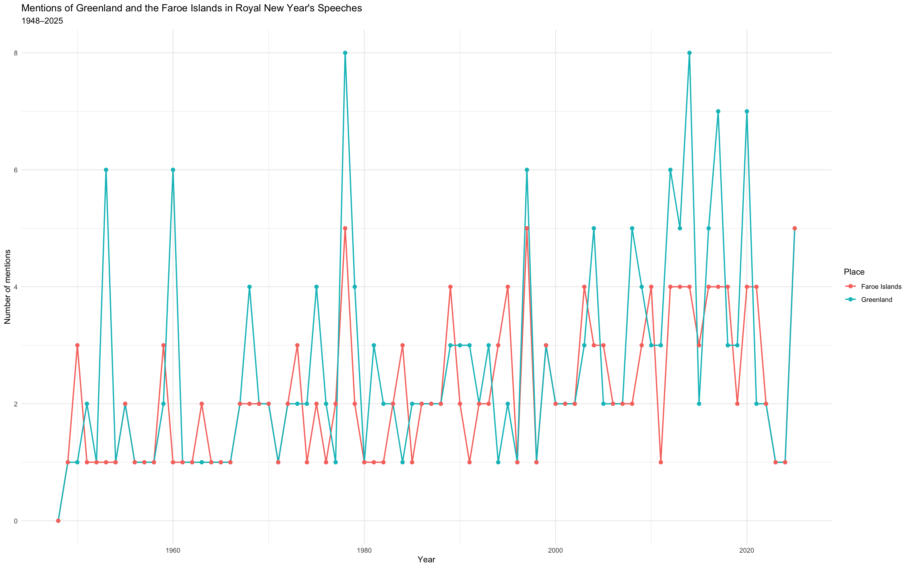
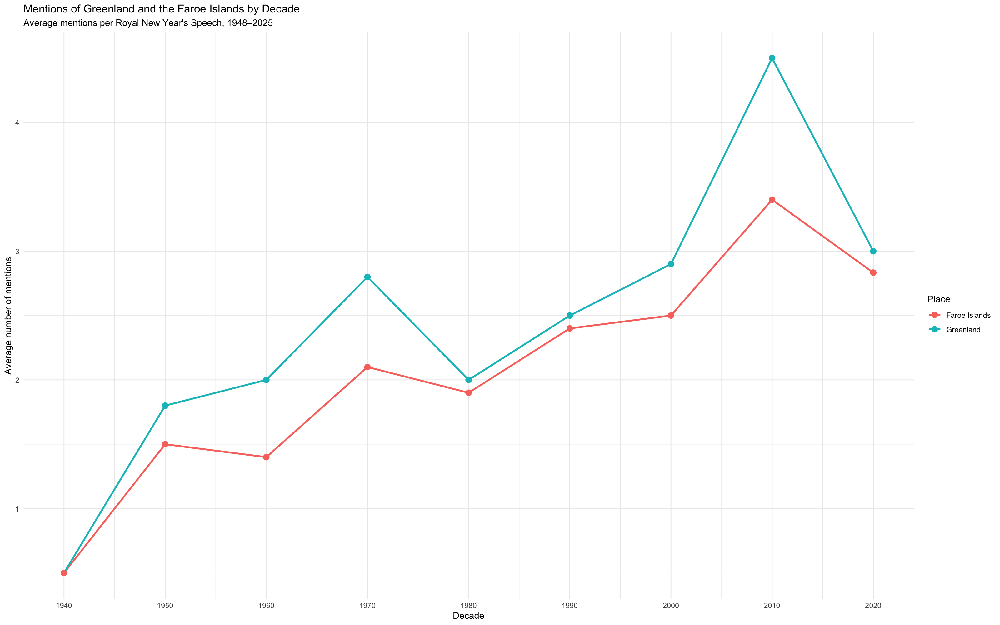
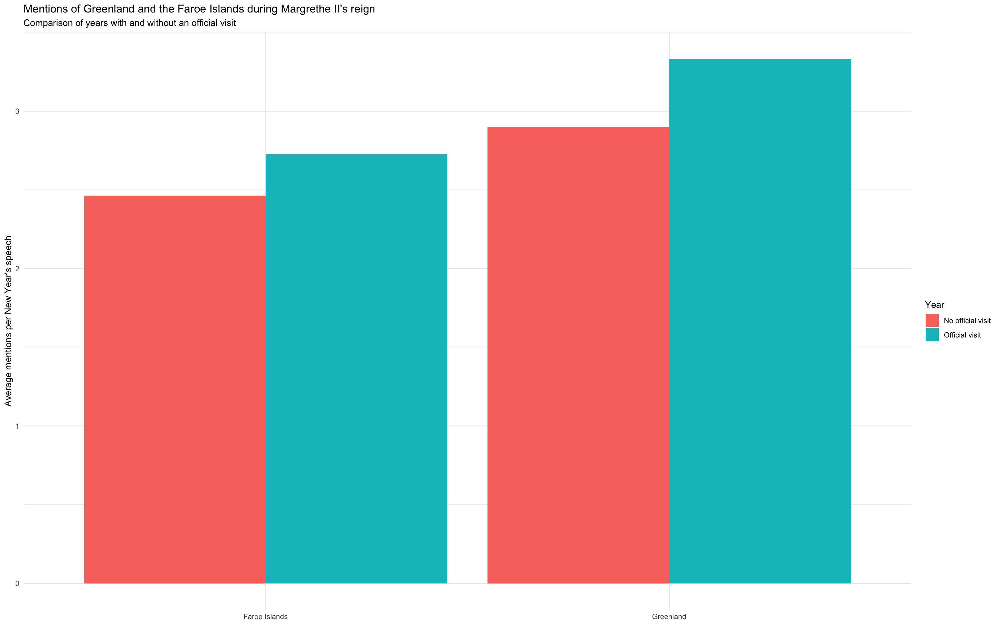

# Greenland and the Faroe Islands in Royal New Year's Speeches

This repository contains the digital product for a project completed in the course *Digital Archives and Methods* at Aarhus University.

## Research question

How has the representation of Greenland and the Faroe Islands in the Royal New Year's Speeches changed between 1948 and 2025, and to what extent can these changes be related to increasing political autonomy and the growing geopolitical importance of the North Atlantic and Arctic?

## Project overview

The project examines 78 Danish Royal New Year's Speeches covering Frederik IX, Margrethe II, and Frederik X. It combines quantitative text analysis with close reading.

The analysis includes:

- Counts of references to Greenland and the Faroe Islands
- Comparisons by year and decade
- References standardized per 1,000 words
- Linear regression of raw and standardized counts
- Comparison of years with and without official royal visits
- Close reading of terminology such as *landsmænd*, *grønlændere*, *færinger*, and references to Greenlandic and Faroese peoples and societies

## Repository contents

- `analysis.R`: complete R code for processing, analysis, statistical testing, and visualisation
- `speech_data.csv`: processed speech dataset used in the analysis
- `speech_texts.rds`: stored speech-text object used during processing
- `visit_comparison.csv`: data comparing mentions in years with and without official visits
- `mentions_by_year.png`: yearly mentions of Greenland and the Faroe Islands
- `mentions_by_decade.png`: average mentions by decade
- `official_visits_comparison.png`: comparison of mentions in years with and without official visits
- `Monarch_NewYear_Speeches.Rproj`: RStudio project file

## Reproducing the analysis

1. Download or clone this repository.
2. Open `Monarch_NewYear_Speeches.Rproj` in RStudio.
3. Open `analysis.R`.
4. Install any required R packages when prompted.
5. Run the script from beginning to end.

## Figures

### Mentions by year

### Average mentions by decade

### Official visits comparison

## Author

Jóhan Winther

## License

The original R code is available under the MIT License. The Royal New Year's Speech texts remain subject to the rights and terms of their original source providers.
